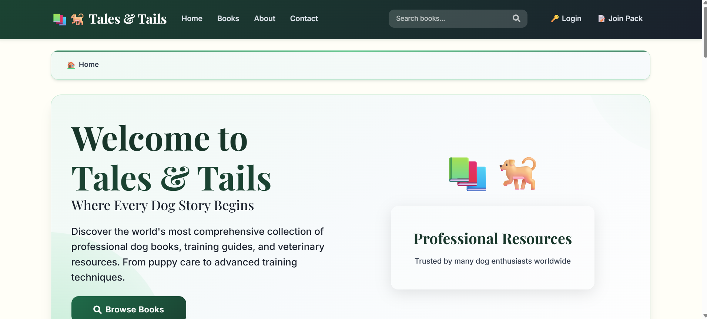
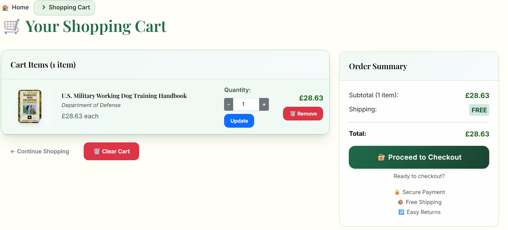
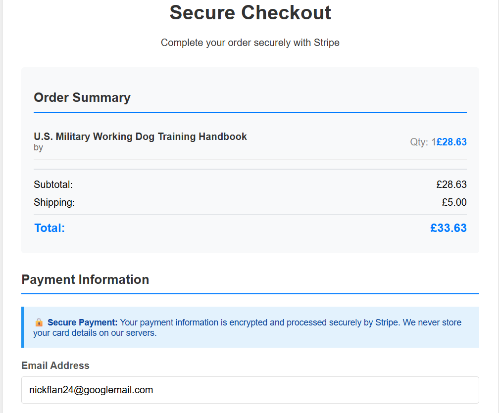
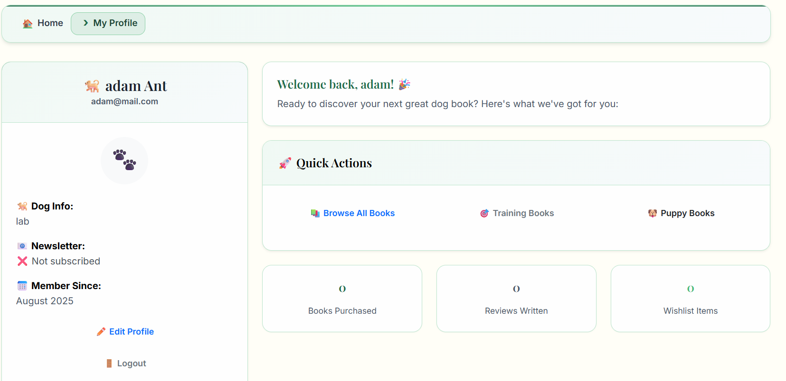

# 📚🐕 Tales & Tails - Where Every Dog Story Begins

A specialized e-commerce platform for dog training, care, and breed books, built with Django and integrated with Google Books API for comprehensive canine literature.

*Professional e-commerce platform specializing in dog training, care, and breed books*

[🌐 Live Demo](https://tales-and-tails-bookstore-2b31d0bd7c27.herokuapp.com/) • [📖 Documentation](docs/) • [🐛 Issues](https://github.com/Nickflanagn24/bookstore/issues) • [🧪 Testing](TESTING.md)

---

## 🎯 Table of Contents

- [Overview](#overview)
- [Key Features](#key-features)
- [Quick Start](#quick-start)
- [Technology Stack](#technology-stack)
- [Project Structure](#project-structure)
- [Core Features](#core-features)
- [API Documentation](#api-documentation)
- [Deployment](#deployment)
- [Contributing](#contributing)
- [License](#license)

---

## 📊 Overview

Tales & Tails is a specialized Django-based e-commerce platform dedicated to dog-related literature. We serve dog owners, professional trainers, veterinarians, and canine enthusiasts with expertly curated books and resources.

**Mission Statement**: *"Every great dog story starts with the right book."*

### 📈 Project Stats
- **137+ Books** in catalog
- **Professional Grade** Django application
- **Mobile-First** responsive design
- **Secure Payments** via Stripe integration
- **SEO Optimized** with structured data

---

## ✨ Key Features

<table>
<tr>
<td width="50%">

### 🛍️ **E-commerce Core**
- Full shopping cart functionality
- Secure Stripe checkout integration
- Order tracking and history
- Email confirmations

</td>
<td width="50%">

### 📚 **Smart Catalog**
- Google Books API integration
- Advanced search and filtering
- Personalized recommendations
- High-quality book covers

</td>
</tr>
<tr>
<td>

### 👤 **User Experience**
- Custom dog owner profiles
- Responsive mobile design
- Professional forest green theme
- Accessibility compliance

</td>
<td>

### 🔐 **Security & Performance**
- Django security best practices
- CSRF protection
- SQL injection prevention
- Performance optimized

</td>
</tr>
</table>

---

## 🛠️ Technology Stack

| Category   | Technology                               | Purpose               |
|------------|------------------------------------------|------------------------|
| Backend    | Django 4.2.7, Python 3.12                 | Core framework         |
| Frontend   | HTML5, CSS3, JavaScript, Bootstrap 5     | User interface         |
| Database   | SQLite (dev), PostgreSQL (prod)          | Data storage           |
| Payments   | Stripe API                               | Secure transactions    |
| APIs       | Google Books API                         | Book catalog           |
| Deployment | Heroku                                   | Cloud hosting          |
| Testing    | Django TestCase, JSHint, W3C Validators  | Quality assurance      |

## 📁 Project Structure

| Directory/File | Purpose |
|----------------|---------|
| `bookstore_project/` | Main Django project configuration |
| `├── settings.py` | Application settings and configuration |
| `├── urls.py` | URL routing and patterns |
| `└── wsgi.py` | WSGI configuration for deployment |
| `books/` | Book catalog and management app |
| `cart/` | Shopping cart functionality |
| `orders/` | Order processing and tracking |
| `accounts/` | User authentication and profiles |
| `templates/` | HTML template files |
| `static/` | CSS, JavaScript, and image files |
| `requirements.txt` | Python package dependencies |
| `README.md` | Project documentation (this file) |
| `TESTING.md` | Testing documentation |

## Features

### 🏠 Homepage - Professional First Impression

*Clean, professional design featuring the forest green theme with hero section showcasing "Where Every Dog Story Begins". Includes featured books carousel, statistics counter (137+ books, professional authors), and clear navigation to book categories. Mobile-responsive layout ensures perfect display across all devices with collapsible navigation menu.*

**Key Features:**
- Hero section with compelling tagline and call-to-action
- Featured books carousel with "Add to Cart" functionality
- Statistics showcase (total books, authors, customer satisfaction)
- Category navigation tiles (Training, Health, Breeds, Behaviour)
- Newsletter subscription form
- Professional forest green colour scheme
- Fully responsive mobile-first design

### 📚 Book Catalogue - Comprehensive Library

*Extensive book listing with 137+ dog-related titles sourced from Google Books API. Features advanced filtering by category (Training, Health, Breeds), price range sorting, and intelligent search functionality. Each book card displays high-quality cover image, title, author, price, star ratings, and quick "Add to Cart" functionality.*

**Key Features:**
- Google Books API integration for comprehensive catalogue
- Advanced search with real-time suggestions
- Category filtering (Dog Training, Health, Breeds, Behaviour)
- Price range filtering and sorting options
- Book cards with cover images, ratings, and pricing
- Pagination for easy browsing
- "Add to Cart" buttons with quantity selectors
- Grid/list view toggle options
- Stock availability indicators

### 🔍 Advanced Search - Smart Discovery

*Real-time search with autocomplete suggestions appearing as users type. Search results show relevant books with highlighted query terms, author information, and pricing. Both mobile and desktop versions provide seamless search experience with dropdown results and category filtering.*

**Key Features:**
- Real-time search suggestions (minimum 3 characters)
- Autocomplete dropdown with book previews
- Search term highlighting in results
- Category-specific search filtering
- Recent searches history
- Voice search capability (mobile)
- Search analytics and popular terms
- No results page with suggested alternatives

### 📖 Book Detail Page - Rich Product Information

*Comprehensive book information including high-quality cover images, detailed descriptions, author biographies, publication details, and customer reviews. Features "Add to Cart" functionality, related book suggestions, schema.org structured data for enhanced SEO, and social sharing options.*

**Key Features:**
- High-resolution book cover images with zoom functionality
- Comprehensive book descriptions and metadata
- Author biographies and credentials
- Customer review system with star ratings
- "Add to Cart" with quantity selection
- Related book recommendations
- Social media sharing buttons
- Schema.org structured data for SEO
- Breadcrumb navigation
- Print-friendly format option
- Wishlist functionality

### 🛒 Shopping Cart - Intuitive E-commerce

*User-friendly cart interface with quantity controls, item removal options, and real-time total calculations. Features persistent cart storage for logged-in users, responsive design for mobile shopping, promotional code input, and clear checkout call-to-action buttons with security badges.*

**Key Features:**
- Real-time quantity updates without page reload
- Individual item removal with confirmation
- Running total calculations including VAT
- Promotional/discount code input field
- Estimated shipping costs calculator
- Persistent cart across sessions (logged-in users)
- Guest checkout option
- Security badges (SSL, payment methods)
- "Continue Shopping" and "Proceed to Checkout" buttons
- Empty cart state with suggested products
- Save for later functionality

### 💳 Secure Checkout - Stripe Integration

*Professional checkout interface with Stripe payment integration ensuring PCI compliance. Features comprehensive order summary, customer information forms, multiple payment options, guest checkout capability, and SSL-secured transaction processing with webhook implementation.*

**Key Features:**
- Stripe payment integration with PCI compliance
- Guest and registered user checkout options
- Multiple payment methods (credit/debit cards, digital wallets)
- Order summary with itemised pricing
- Shipping address form with validation
- Billing address options (same as shipping/different)
- Order notes and special instructions field
- SSL encryption and security badges
- Real-time form validation
- Order confirmation emails
- Webhook integration for reliable processing

### 🛠️ Admin Dashboard - Content Management

*Django admin interface customised for bookstore management with comprehensive book inventory control, order processing capabilities, customer management tools, and detailed reporting dashboards. Staff can efficiently manage the entire catalogue, process orders, and maintain customer relationships.*

**Key Features:**
- Complete CRUD operations for book management
- Order processing and fulfilment tracking
- Customer account management and support
- Inventory tracking with low stock alerts
- Sales reporting and analytics dashboard
- Staff user management with role-based permissions
- Bulk operations for catalogue management
- Export functionality for reports
- Email template management
- System configuration and settings
- can be accessed from the front-end drop down if staff logged in.

### 👤 User Profile - Personalised Dashboard

*Custom user dashboard featuring dog profile information, complete order history, personalised book recommendations, account management options, and newsletter preferences. Users can manage multiple dog profiles and access tailored content based on their dogs' breeds and training needs.*

**Key Features:**
- Personal information management
- Multiple dog profiles (breed, age, training level)
- Complete order history with reorder options
- Personalised book recommendations
- Wishlist management
- Review history and editing
- Newsletter subscription preferences
- Account security settings
- Address book management
- Download order receipts/invoices

### 📱 Mobile Experience - Mobile-First Design

*Fully responsive mobile interface with collapsible hamburger navigation, touch-friendly buttons, optimised search functionality, and streamlined shopping experience. Cart and checkout processes are specifically designed for mobile users with large touch targets and simplified forms.*

**Key Features:**
- Hamburger menu with smooth animations
- Touch-optimised buttons and forms
- Mobile-specific search interface
- Swipe gestures for product galleries
- Mobile payment options (Apple Pay, Google Pay)
- Optimised images for faster loading
- Progressive Web App capabilities
- Offline browsing functionality
- Mobile-specific user interface elements

### ⭐ Review System - Community Engagement

*Integrated customer review system allowing registered users to rate and review purchased books. Features five-star rating system, detailed written reviews, helpful/unhelpful voting, review moderation, and verified purchase badges to build community trust.*

**Key Features:**
- Five-star rating system with half-star precision
- Detailed written reviews with character limits
- Verified purchase badges for authenticity
- Helpful/unhelpful voting system
- Review sorting (newest, oldest, highest rated)
- Photo uploads with reviews
- Review moderation and reporting
- Author/publisher response capability
- Review summary statistics
- Integration with Google Reviews

### 📧 Email Communications - Professional Outreach

*Comprehensive email system including order confirmations, shipping notifications, newsletter communications, and password reset emails. Professional HTML templates with brand consistency, mobile-responsive design, automated trigger-based messaging, and unsubscribe management.*

**Key Features:**
- Order confirmation emails with detailed receipts
- Shipping notification with tracking information
- Welcome emails for new registrations
- Password reset and security notifications
- Newsletter with book recommendations
- Abandoned cart recovery emails
- Mobile-responsive email templates
- Brand-consistent design and messaging
- Automated trigger-based sending
- Unsubscribe and preference management

### 🚫 Error Pages - User-Friendly Experience

*Custom-designed 404 error page maintaining brand consistency whilst providing helpful navigation options. Features search functionality, popular book categories, and clear paths back to the main site with dog-themed illustrations and friendly messaging.*

**Key Features:**
- Custom 404 error page with brand consistency
- Search functionality from error page
- Popular categories and book suggestions
- Breadcrumb navigation
- Contact information for support
- Dog-themed illustrations and friendly messaging
- Mobile-responsive error page design
- SEO-friendly error handling

