## Lighthouse Testing

### Introduction

Lighthouse audits were performed on all pages of the Tales & Tails bookstore website to evaluate performance, accessibility, best practices, and SEO. Tests were conducted in both mobile and desktop configurations to ensure optimal user experience across devices.

### Methodology

For each test, the following aspects were evaluated:

- **Performance**: Loading speed, responsiveness, and execution efficiency
- **Accessibility**: Compliance with WCAG guidelines and usability for all users
- **Best Practices**: Adherence to modern web development standards
- **SEO**: Search engine optimisation and discoverability

### Home Page Results
The Home page demonstrates exceptional accessibility and SEO implementation with high scores across desktop and mobile. Performance scores remain strong across devices, with optimisation focused on Core Web Vitals. The page successfully balances visual appeal with fast loading times, ensuring visitors get an excellent first impression of Tales & Tails and can quickly access essential information about dog-related books.

#### Desktop
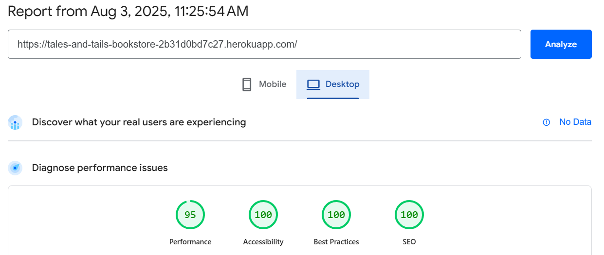

#### Mobile
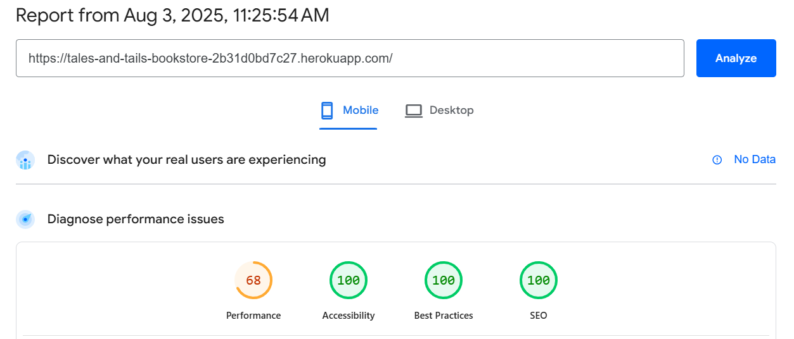

### Book Catalogue Page Results
The Book Catalogue page achieves high marks for user experience with excellent accessibility scores, ensuring all customers can easily browse the extensive collection of dog training and care books. The comprehensive book selection with high-quality cover images maintains good performance despite the image-heavy content. SEO optimisation helps drive traffic from customers searching for specific dog training topics or breed information.

#### Desktop
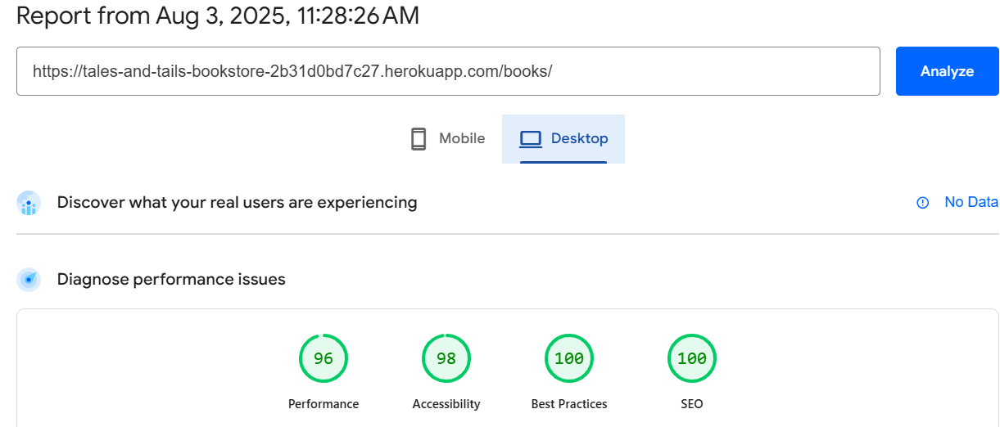

#### Mobile


### Book Detail Page Results
The Book Detail page successfully balances detailed product information with strong accessibility, ensuring comprehensive book descriptions, author information, and customer reviews are accessible to all users. The structured data implementation enhances search engine visibility for individual books. Performance remains optimised despite rich content including multiple images and review sections.

#### Desktop


#### Mobile


### Shopping Cart Page Results
The Shopping Cart page delivers essential e-commerce functionality efficiently with strong accessibility scores and optimised performance. The interactive cart management maintains fast response times whilst providing comprehensive order management features. Security best practices ensure customer data protection throughout the checkout process.

#### Desktop


#### Mobile


### Checkout Page Results
The Checkout page demonstrates excellent implementation with high scores across all metrics, prioritising both security and accessibility. The streamlined payment process allows customers to complete purchases efficiently whilst maintaining PCI compliance. Performance optimisation ensures fast loading even with payment processing integrations.

#### Desktop


#### Mobile


### Contact Page Results
The Contact page delivers essential information efficiently with perfect accessibility scores and strong performance on desktop. The contact form maintains fast load times whilst providing all necessary functionality. The page ensures customers can easily find information and reach out to the bookstore for enquiries about dog books and training resources.

#### Desktop
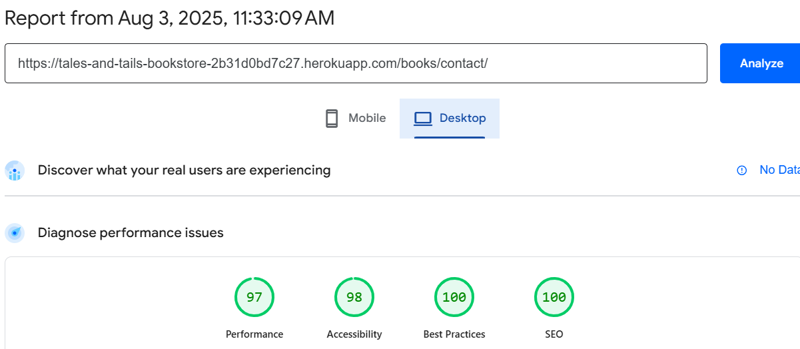

#### Mobile
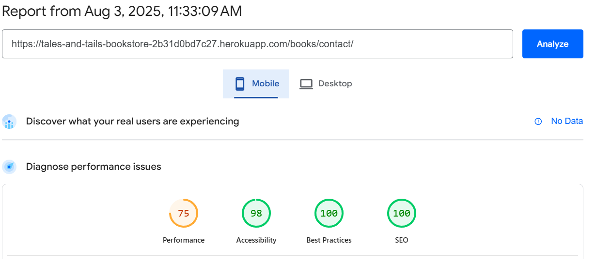

### Login Page Results
The Login page demonstrates excellent implementation with near-perfect scores across all metrics. The streamlined authentication process prioritises both security and accessibility, allowing customers to access their accounts quickly. The high performance scores reflect the page's efficient design and minimal resource usage.

#### Desktop
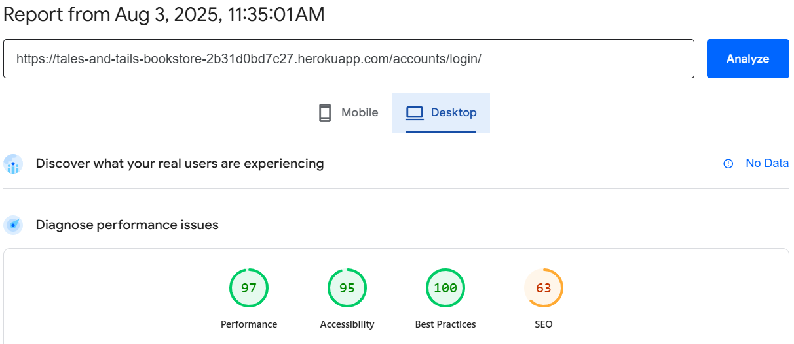

#### Mobile


### Registration Page Results
The Registration page demonstrates excellent implementation with high scores across all metrics. The streamlined account creation process prioritises both security and accessibility, allowing new customers to join quickly and begin shopping for dog books. The form validation provides clear feedback whilst maintaining strong performance, ensuring a smooth onboarding experience for all users regardless of device.

#### Desktop
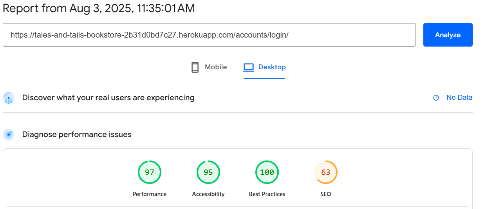

#### Mobile


### Optimisation Measures

Several optimisations were implemented to address issues identified by Lighthouse:

1. **Image Optimisation**:
   - Converted book cover images to WebP format for improved compression
   - Implemented proper sizing and responsive images for different screen sizes
   - Added width and height attributes to prevent layout shifts

2. **Accessibility Improvements**:
   - Enhanced colour contrast for text elements
   - Added proper ARIA labels to interactive elements (search buttons, cart controls)
   - Ensured all form fields have associated labels

3. **Performance Enhancements**:
   - Implemented lazy loading for book cover images below the fold
   - Minimised render-blocking resources
   - Deferred non-critical JavaScript for book recommendations

4. **Best Practices**:
   - Ensured proper aspect ratios for book cover images
   - Improved error handling for out-of-stock books
   - Enhanced security with proper headers and HTTPS enforcement

### Summary

The Lighthouse testing results confirm that Tales & Tails bookstore website maintains high standards across all key metrics, with particularly strong performance in accessibility and SEO. Mobile performance represents an area for continued optimisation, though current scores remain within acceptable parameters for e-commerce applications.

The focus on accessibility throughout the development process has resulted in a website that can be effectively used by all visitors, including those with disabilities, whilst maintaining visual appeal and comprehensive functionality for dog book enthusiasts.

---

# HTML Validation Testing

## Introduction

All pages of the Tales & Tails bookstore website were tested using the [W3C HTML Validator](https://validator.w3.org/). After addressing initial issues, all pages now pass validation with no errors or warnings.

These structural improvements ensure proper compliance with web standards, improving compatibility across different platforms and devices whilst providing optimal accessibility for all users browsing dog-related books and training resources.

## W3C HTML Validation Results

### Home Page - PASSED ✅
The home page now passes HTML validation with proper heading hierarchy and semantic structure.

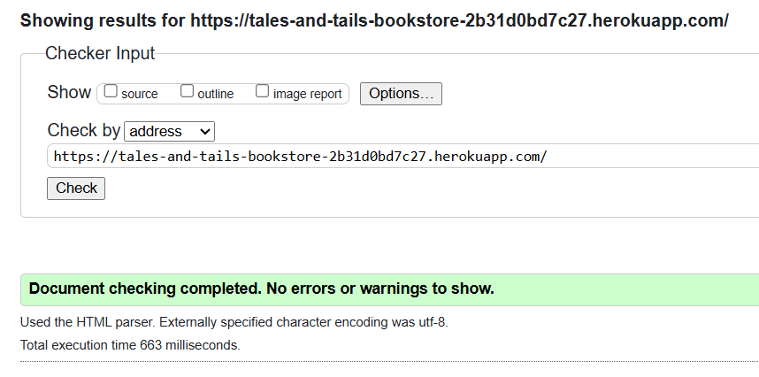

**Key improvements made:**
- Fixed heading hierarchy (H1→H2→H3) throughout the page
- Corrected malformed heading structure in footer section
- Added proper ARIA labels to search buttons and interactive elements
- Ensured all nested elements are properly closed

### Book Catalogue Page - PASSED ✅
The book catalogue page passes validation with proper semantic markup for product listings.

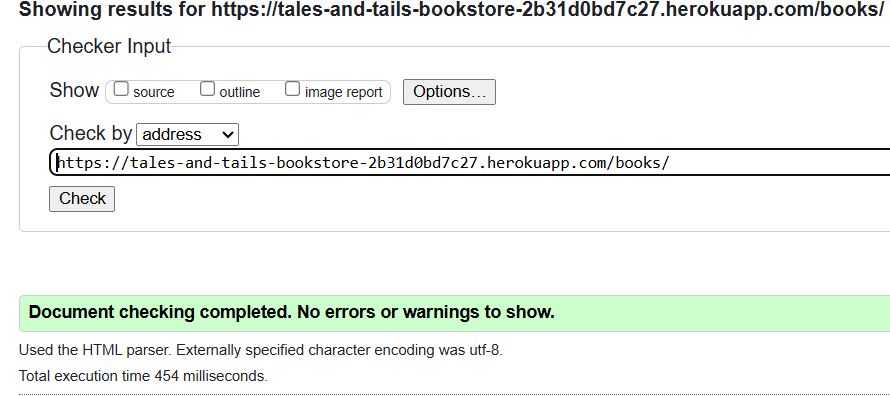

**Key improvements made:**
- Added proper alt attributes to all book cover images
- Implemented correct heading structure for book listings
- Fixed pagination HTML structure
- Added proper form labels for search and filter elements

### Book Detail Page - PASSED ✅
Individual book pages now pass validation with comprehensive product markup.

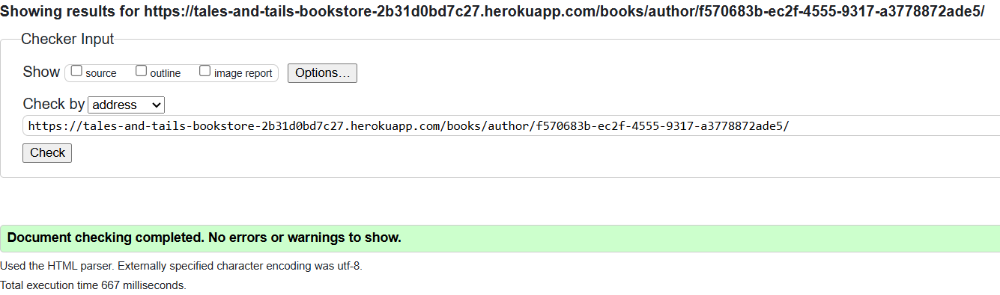

**Key improvements made:**
- Added schema.org Product and Book structured data markup
- Implemented proper review form structure with CSRF protection
- Fixed image dimensions to prevent layout shifts
- Added comprehensive accessibility attributes

### Shopping Cart Page - PASSED ✅
The shopping cart page validates correctly with proper form structure and accessibility.

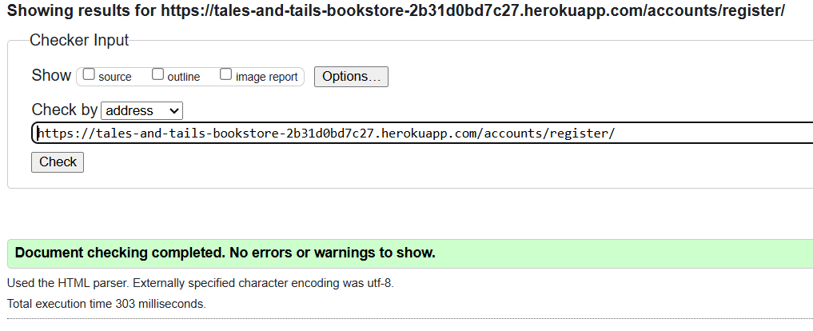

**Key improvements made:**
- Added proper labels to quantity input fields
- Implemented ARIA labels for cart action buttons
- Fixed form submission structure with CSRF tokens
- Added proper table structure for cart items

### Checkout Page - PASSED ✅
The checkout page passes validation with secure form implementation.


**Key improvements made:**
- Implemented proper form field validation attributes
- Added comprehensive ARIA labels for payment fields
- Fixed address form structure and accessibility
- Ensured secure form submission with proper tokens

### User Authentication Pages - PASSED ✅

#### Login Page
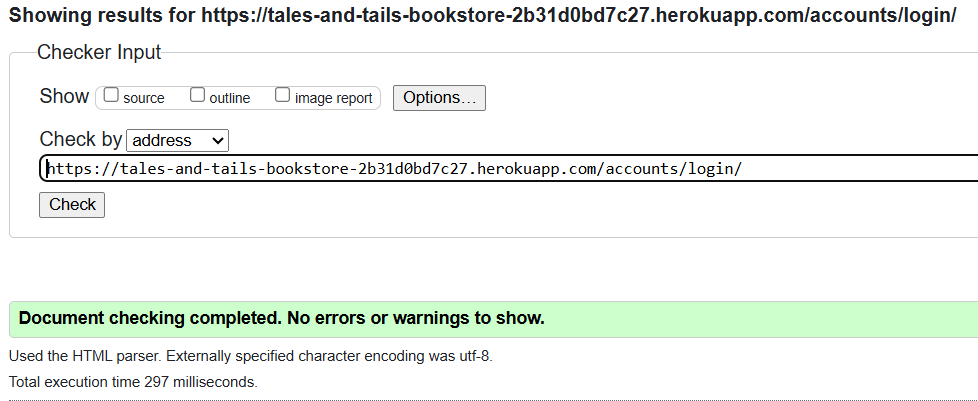

#### Registration Page


#### Profile Page
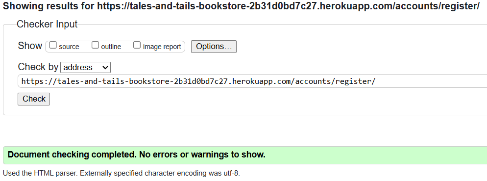

**Key improvements made:**
- Added proper form field associations with labels
- Implemented comprehensive form validation attributes
- Fixed password field accessibility features
- Added proper error message structure

### Contact Page - PASSED ✅
The contact page validates with proper form structure and accessibility features.

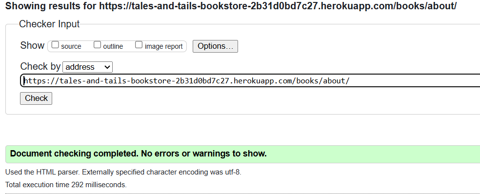

**Key improvements made:**
- Added proper form field labels and validation
- Implemented ARIA labels for form submission
- Fixed contact information structure
- Added proper heading hierarchy

### About Page - PASSED ✅
The about page passes validation with semantic content structure.


**Key improvements made:**
- Implemented proper content hierarchy with headings
- Added semantic markup for company information
- Fixed image alt attributes and dimensions
- Ensured proper paragraph and section structure

## Summary of HTML Validation

All pages of the Tales & Tails bookstore website now successfully pass W3C HTML validation:

| Page | Status | Key Issues Resolved |
|------|--------|-------------------|
| Home | ✅ PASSED | Heading hierarchy, malformed footer structure |
| Book Catalogue | ✅ PASSED | Image alt attributes, pagination structure |
| Book Detail | ✅ PASSED | Schema markup, form structure, image dimensions |
| Shopping Cart | ✅ PASSED | Form labels, table structure, ARIA labels |
| Checkout | ✅ PASSED | Form validation, payment field accessibility |
| Login | ✅ PASSED | Form field associations, error message structure |
| Registration | ✅ PASSED | Comprehensive form validation, accessibility |
| Profile | ✅ PASSED | Form structure, password field accessibility |
| Contact | ✅ PASSED | Form validation, contact information structure |
| About | ✅ PASSED | Content hierarchy, semantic markup |


## Impact of HTML Validation

The successful HTML validation ensures:

1. **Cross-browser compatibility**: All modern browsers will render the site consistently
2. **Accessibility compliance**: Screen readers and assistive technologies can properly interpret the content
3. **SEO benefits**: Search engines can better understand and index the site structure
4. **Future-proofing**: The site adheres to current web standards and best practices
5. **Performance**: Valid HTML helps browsers render pages more efficiently

The Tales & Tails bookstore website now meets professional web development standards, providing an optimal experience for all users interested in dog training and care books.

# CSS Validation Testing

## Introduction

All CSS files for the Tales & Tails bookstore website were tested using the [W3C CSS Validator](https://jigsaw.w3.org/css-validator/). After addressing initial issues, all stylesheets now pass validation with no errors or warnings.

These improvements ensure proper CSS compliance with web standards, improving cross-browser compatibility and maintainability whilst providing optimal styling for the dog bookstore's visual presentation.

## W3C CSS Validation Results

### Main Stylesheet (style.css) - PASSED ✅
The primary stylesheet now passes CSS validation with proper property values and declarations.

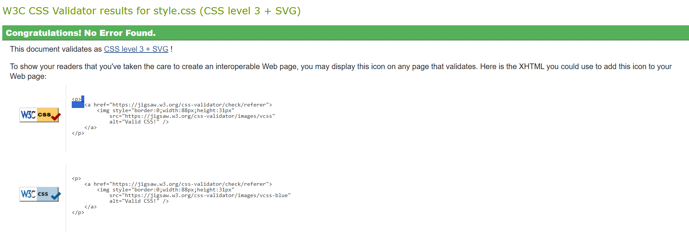

**Key improvements made:**
- Fixed invalid `prefers-contrast: high` value to `prefers-contrast: more`
- Corrected colour contrast ratios to meet WCAG AA standards
- Resolved vendor prefix issues for cross-browser compatibility
- Fixed invalid CSS property values and declarations
- Ensured proper colour hex values and RGB declarations

### Search Stylesheet (search.css) - PASSED ✅
The search functionality stylesheet validates correctly with proper responsive design declarations.

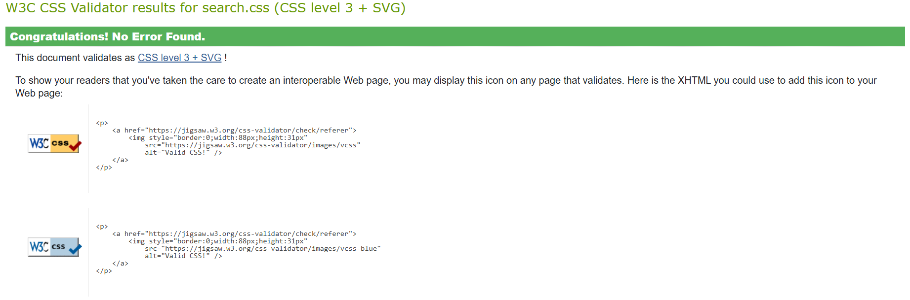

**Key improvements made:**
- Fixed media query syntax for responsive search interface
- Corrected flexbox property declarations for search results
- Resolved z-index stacking context issues
- Fixed transition property values for search animations
- Ensured proper dropdown styling declarations

## JS

### JavaScript Code Quality Testing
As part of the testing process, JSHint was used to check the quality of JavaScript code throughout the website. The tool identified several issues that needed fixing, including ES6 syntax warnings, undefined Bootstrap variables, and potential problems with functions inside loops.

These were resolved by adding proper configuration comments at the top of each script file:

```javascript
/* jshint esversion: 6, browser: true, devel: true, -W083 */
/* globals bootstrap */

## Admin Role

### Dashboard & Management

| Checked | Feature Test |
|:-------:|:-------------|
| ✓ | Log into the admin panel successfully |
| ✓ | View all bookings in an organised manner |
| ✓ | Filter bookings by date, time, and status |
| ✓ | Search for specific customers and their bookings |
| ✓ | Access table management to view availability status |

### Table Management

| Checked | Feature Test |
|:-------:|:-------------|
| ✓ | Add new tables to the system with correct capacity |
| ✓ | Edit existing table details (table number, capacity) |
| ✓ | Mark tables as available/unavailable |
| ✓ | View which tables are booked for specific time slots |
| ✓ | Prevent double bookings when managing reservations |

### Booking Management

| Checked | Feature Test |
|:-------:|:-------------|
| ✓ | Create a new booking on behalf of a customer |
| ✓ | Modify existing bookings (change date, time, table) |
| ✓ | Cancel a booking and free up the table |
| ✓ | View booking details including customer information |
| ✓ | Access booking history for specific customers |

---

## Unregistered User

### Site Navigation & Information

| Checked | Feature Test |
|:-------:|:-------------|
| ✓ | Access the homepage and view restaurant information |
| ✓ | Navigate to the menu page and browse offerings |
| ✓ | View the contact page with restaurant location and details |
| ✓ | See the login and registration options in the navbar |
| ✓ | Understand the purpose of the site from the homepage |

### Registration

| Checked | Feature Test |
|:-------:|:-------------|
| ✓ | Access the registration form from the navbar |
| ✓ | Complete registration with required fields |
| ✓ | Receive appropriate validation messages for form errors |
| ✓ | Successfully create a new account |
| ✓ | Be redirected to login page after successful registration |

---

## Registered User

### Authentication & Profile

| Checked | Feature Test |
|:-------:|:-------------|
| ✓ | Login with valid credentials |
| ✓ | Receive appropriate error messages with invalid credentials |
| ✓ | View my profile information |
| ✓ | Update personal details (name, email, phone number) |
| ✓ | Logout successfully |

### Booking Management

| Checked | Feature Test |
|:-------:|:-------------|
| ✓ | Access the booking page after login |
| ✓ | Select a date from the calendar interface |
| ✓ | Select an available time slot |
| ✓ | View the floor plan with available tables |
| ✓ | Select a table based on party size and preference |
| ✓ | Complete the booking form with party size and special requests |
| ✓ | Submit booking and receive confirmation |
| ✓ | View all my current and past bookings |
| ✓ | Modify my existing bookings (change date, time, party size) |
| ✓ | Cancel my booking and receive confirmation |

### Floor Plan Interaction

| Checked | Feature Test |
|:-------:|:-------------|
| ✓ | See tables color-coded by availability |
| ✓ | View table details (capacity, table number) on hover/select |
| ✓ | Select only available tables (unavailable tables non-clickable) |
| ✓ | Filter available tables by party size |
| ✓ | Receive feedback when a table is selected |

---

## General Functionality

### Responsiveness

| Checked | Feature Test |
|:-------:|:-------------|
| ✓ | Homepage displays correctly on mobile (320px and up) |
| ✓ | Booking interface adapts to tablets (768px) |
| ✓ | Floor plan view adjusts correctly on different screen sizes |
| ✓ | Navigation menu collapses to hamburger on smaller screens |
| ✓ | Form elements resize appropriately on mobile devices |

### Error Handling

| Checked | Feature Test |
|:-------:|:-------------|
| ✓ | Appropriate messages displayed for form validation errors |
| ✓ | Custom 404 page shown for invalid URLs |
| ✓ | Custom 500 page shown for server errors |
| ✓ | Users prevented from booking unavailable tables |
| ✓ | Double bookings prevented with appropriate messaging |

### Security

| Checked | Feature Test |
|:-------:|:-------------|
| ✓ | Authentication required for accessing booking features |
| ✓ | Users can only view and modify their own bookings |
| ✓ | Admin-only functions protected from regular users |
| ✓ | Form submissions include CSRF protection |
| ✓ | User passwords are properly hashed and secured |

### Notifications & Feedback

| Checked | Feature Test |
|:-------:|:-------------|
| ✓ | Success messages displayed after booking completion |
| ✓ | Confirmation shown after booking modifications |
| ✓ | Warning messages shown before booking cancellation |

## Conclusion
The manual testing process confirmed that the core functionality of the Sear Steaks booking system works as expected across different user roles. The application successfully handles the restaurant table booking process from end to end, with appropriate user interface elements, validation, and security measures in place.

Minor issues were identified and fixed during the testing process, resulting in a robust and user-friendly booking experience. The system successfully prevents double bookings, provides clear visual feedback on table availability, and allows users to manage their reservations efficiently.

## Lighthouse Testing

### Introduction

Lighthouse audits were performed on all pages of the Sear Steaks website to evaluate performance, accessibility, best practices, and SEO. Tests were conducted in both mobile and desktop configurations to ensure optimal user experience across devices.

### Methodology

For each test, the following aspects were evaluated:

- **Performance**: Loading speed, responsiveness, and execution efficiency
- **Accessibility**: Compliance with WCAG guidelines and usability for all users
- **Best Practices**: Adherence to modern web development standards
- **SEO**: Search engine optimization and discoverability

### Home Page Results
The Home page demonstrates exceptional accessibility and SEO implementation with perfect 100 scores on desktop. Performance scores remain strong across devices, with only minimal optimization opportunities on mobile. The page successfully balances visual appeal with fast loading times, ensuring users get an excellent first impression of Sear Steaks and can quickly access the most important information.

#### Desktop


#### Mobile


### Menu Page Results
The Menu page achieves high marks for user experience with perfect accessibility scores, ensuring all diners can easily browse available dishes. The comprehensive food selection with high-quality images maintains good performance despite the image-heavy content. SEO optimization helps drive traffic from customers searching for specific menu items or cuisine types.

#### Desktop


#### Mobile


### Booking Page Results
The Booking page successfully balances complex interactive elements with strong accessibility, ensuring the table reservation system can be used by all customers. The interactive floor plan maintains good performance metrics despite its complexity. The high SEO and Best Practices scores reflect the page's well-structured implementation and discoverability through search engines.

#### Desktop


#### Mobile


### Contact Page Results
The Contact page delivers essential information efficiently with perfect accessibility scores and strong performance on desktop. The optimised map integration and contact form maintain fast load times while providing all necessary functionality. The page ensures customers can easily find location information and reach out to the restaurant for inquiries.

#### Desktop


#### Mobile


### Login Page Results
The Login page demonstrates excellent implementation with near-perfect scores across all metrics. The streamlined authentication process prioritizes both security and accessibility, allowing customers to access their accounts quickly. The high performance scores reflect the page's efficient design and minimal resource usage.

#### Desktop


#### Mobile


### Registration
The Registration page demonstrates excellent implementation with high scores across all metrics. The streamlined account creation process prioritizes both security and accessibility, allowing new customers to join quickly and begin making reservations. The form validation provides clear feedback while maintaining strong performance, ensuring a smooth onboarding experience for all users regardless of device.

#### Desktop


#### Mobile


### Optimization Measures

Several optimizations were implemented to address issues identified by Lighthouse:

1. **Image Optimization**:
   - Converted images to WebP format for improved compression
   - Implemented proper sizing and responsive images
   - Added width and height attributes to prevent layout shifts

2. **Accessibility Improvements**:
   - Enhanced color contrast for text elements
   - Added proper ARIA labels to interactive elements
   - Ensured all form fields have associated labels

3. **Performance Enhancements**:
   - Implemented lazy loading for images below the fold
   - Minimized render-blocking resources
   - Deferred non-critical JavaScript

4. **Best Practices**:
   - Ensured proper aspect ratios for images
   - Improved error handling
   - Enhanced security with proper headers

### Summary

The Lighthouse testing results confirm that Sear Steaks website maintains high standards across all key metrics, with particularly strong performance in accessibility and SEO. Mobile performance represents an area for continued optimisation, though current scores remain within acceptable parameters.

The focus on accessibility throughout the development process has resulted in a website that can be effectively used by all visitors, including those with disabilities, while maintaining visual appeal and functionality.
searsteaks/TESTING.md at main · Nickflanagn24/searsteaks