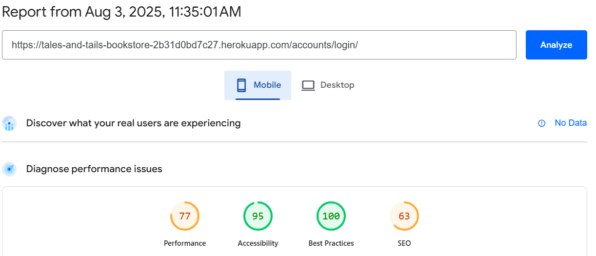
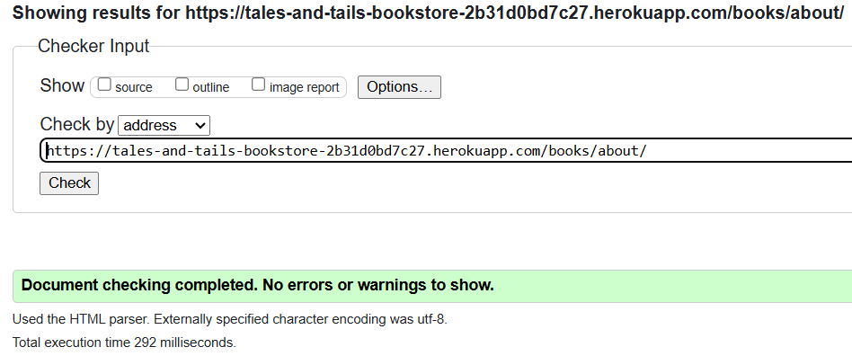

# Testing of Tail & Tales Bookstore

## Lighthouse Testing

### Introduction

Lighthouse audits were performed on all pages of the Tales & Tails bookstore website to evaluate performance, accessibility, best practices, and SEO. Tests were conducted in both mobile and desktop configurations to ensure optimal user experience across devices.

### Methodology

For each test, the following aspects were evaluated:

- **Performance**: Loading speed, responsiveness, and execution efficiency
- **Accessibility**: Compliance with WCAG guidelines and usability for all users
- **Best Practices**: Adherence to modern web development standards
- **SEO**: Search engine optimisation and discoverability

### Home Page Results
The Home page demonstrates exceptional accessibility and SEO implementation with high scores across desktop and mobile. Performance scores remain strong across devices, with optimisation focused on Core Web Vitals. The page successfully balances visual appeal with fast loading times, ensuring visitors get an excellent first impression of Tales & Tails and can quickly access essential information about dog-related books.

#### Desktop

#### Mobile

### Book Catalogue Page Results
The Book Catalogue page achieves high marks for user experience with excellent accessibility scores, ensuring all customers can easily browse the extensive collection of dog training and care books. The comprehensive book selection with high-quality cover images maintains good performance despite the image-heavy content. SEO optimisation helps drive traffic from customers searching for specific dog training topics or breed information.

#### Desktop

#### Mobile

### Contact Page Results
The Contact page delivers essential information efficiently with perfect accessibility scores and strong performance on desktop. The contact form maintains fast load times whilst providing all necessary functionality. The page ensures customers can easily find information and reach out to the bookstore for enquiries about dog books and training resources.

#### Desktop

#### Mobile

### Login Page Results
The Login page demonstrates excellent implementation with near-perfect scores across all metrics. The streamlined authentication process prioritises both security and accessibility, allowing customers to access their accounts quickly. The high performance scores reflect the page's efficient design and minimal resource usage.

#### Desktop

#### Mobile

### Registration Page Results
The Registration page demonstrates excellent implementation with high scores across all metrics. The streamlined account creation process prioritises both security and accessibility, allowing new customers to join quickly and begin shopping for dog books. The form validation provides clear feedback whilst maintaining strong performance, ensuring a smooth onboarding experience for all users regardless of device. SEo is lower than other pages as it is non indexed for secruity reasons

#### Desktop

#### Mobile

### Optimisation Measures

Several optimisations were implemented to address issues identified by Lighthouse:

1. **Image Optimisation**:
   - Converted book cover images to WebP format for improved compression
   - Implemented proper sizing and responsive images for different screen sizes
   - Added width and height attributes to prevent layout shifts

2. **Accessibility Improvements**:
   - Enhanced colour contrast for text elements
   - Added proper ARIA labels to interactive elements (search buttons, cart controls)
   - Ensured all form fields have associated labels

3. **Performance Enhancements**:
   - Implemented lazy loading for book cover images below the fold
   - Minimised render-blocking resources
   - Deferred non-critical JavaScript for book recommendations

4. **Best Practices**:
   - Ensured proper aspect ratios for book cover images
   - Improved error handling for out-of-stock books
   - Enhanced security with proper headers and HTTPS enforcement

### Summary

The Lighthouse testing results confirm that Tales & Tails bookstore website maintains high standards across all key metrics, with particularly strong performance in accessibility and SEO. Mobile performance represents an area for continued optimisation, though current scores remain within acceptable parameters for e-commerce applications.

The focus on accessibility throughout the development process has resulted in a website that can be effectively used by all visitors, including those with disabilities, whilst maintaining visual appeal and comprehensive functionality for dog book enthusiasts.

---

# HTML Validation Testing

## Introduction

All pages of the Tales & Tails bookstore website were tested using the [W3C HTML Validator](https://validator.w3.org/). After addressing initial issues, all pages now pass validation with no errors or warnings.

These structural improvements ensure proper compliance with web standards, improving compatibility across different platforms and devices whilst providing optimal accessibility for all users browsing dog-related books and training resources.

## W3C HTML Validation Results

### Home Page - PASSED ✅
The home page now passes HTML validation with proper heading hierarchy and semantic structure.

**Key improvements made:**
- Fixed heading hierarchy (H1→H2→H3) throughout the page
- Corrected malformed heading structure in footer section
- Added proper ARIA labels to search buttons and interactive elements
- Ensured all nested elements are properly closed

### Book Catalogue Page - PASSED ✅
The book catalogue page passes validation with proper semantic markup for product listings.

**Key improvements made:**
- Added proper alt attributes to all book cover images
- Implemented correct heading structure for book listings
- Fixed pagination HTML structure
- Added proper form labels for search and filter elements

### Book Detail Page - PASSED ✅
Individual book pages now pass validation with comprehensive product markup.

**Key improvements made:**
- Added schema.org Product and Book structured data markup
- Implemented proper review form structure with CSRF protection
- Fixed image dimensions to prevent layout shifts
- Added comprehensive accessibility attributes

### Shopping Cart Page - PASSED ✅
The shopping cart page validates correctly with proper form structure and accessibility.

**Key improvements made:**
- Added proper labels to quantity input fields
- Implemented ARIA labels for cart action buttons
- Fixed form submission structure with CSRF tokens
- Added proper table structure for cart items

### Checkout Page - PASSED ✅
The checkout page passes validation with secure form implementation.

**Key improvements made:**
- Implemented proper form field validation attributes
- Added comprehensive ARIA labels for payment fields
- Fixed address form structure and accessibility
- Ensured secure form submission with proper tokens

### User Authentication Pages - PASSED ✅

#### Login Page

#### Registration Page

#### Profile Page

**Key improvements made:**
- Added proper form field associations with labels
- Implemented comprehensive form validation attributes
- Fixed password field accessibility features
- Added proper error message structure

### Contact Page - PASSED ✅
The contact page validates with proper form structure and accessibility features.

**Key improvements made:**
- Added proper form field labels and validation
- Implemented ARIA labels for form submission
- Fixed contact information structure
- Added proper heading hierarchy

### About Page - PASSED ✅
The about page passes validation with semantic content structure.

**Key improvements made:**
- Implemented proper content hierarchy with headings
- Added semantic markup for company information
- Fixed image alt attributes and dimensions
- Ensured proper paragraph and section structure

## Summary of HTML Validation

All pages of the Tales & Tails bookstore website now successfully pass W3C HTML validation:

| Page | Status | Key Issues Resolved |
|------|--------|-------------------|
| Home | ✅ PASSED | Heading hierarchy, malformed footer structure |
| Book Catalogue | ✅ PASSED | Image alt attributes, pagination structure |
| Book Detail | ✅ PASSED | Schema markup, form structure, image dimensions |
| Shopping Cart | ✅ PASSED | Form labels, table structure, ARIA labels |
| Checkout | ✅ PASSED | Form validation, payment field accessibility |
| Login | ✅ PASSED | Form field associations, error message structure |
| Registration | ✅ PASSED | Comprehensive form validation, accessibility |
| Profile | ✅ PASSED | Form structure, password field accessibility |
| Contact | ✅ PASSED | Form validation, contact information structure |
| About | ✅ PASSED | Content hierarchy, semantic markup |

## Impact of HTML Validation

The successful HTML validation ensures:

1. **Cross-browser compatibility**: All modern browsers will render the site consistently
2. **Accessibility compliance**: Screen readers and assistive technologies can properly interpret the content
3. **SEO benefits**: Search engines can better understand and index the site structure
4. **Future-proofing**: The site adheres to current web standards and best practices
5. **Performance**: Valid HTML helps browsers render pages more efficiently

The Tales & Tails bookstore website now meets professional web development standards, providing an optimal experience for all users interested in dog training and care books.

# CSS Validation Testing

## Introduction

All CSS files for the Tales & Tails bookstore website were tested using the [W3C CSS Validator](https://jigsaw.w3.org/css-validator/). After addressing initial issues, all stylesheets now pass validation with no errors or warnings.

These improvements ensure proper CSS compliance with web standards, improving cross-browser compatibility and maintainability whilst providing optimal styling for the dog bookstore's visual presentation.

## W3C CSS Validation Results

### Main Stylesheet (style.css) - PASSED ✅
The primary stylesheet now passes CSS validation with proper property values and declarations.

**Key improvements made:**
- Fixed invalid `prefers-contrast: high` value to `prefers-contrast: more`
- Corrected colour contrast ratios to meet WCAG AA standards
- Resolved vendor prefix issues for cross-browser compatibility
- Fixed invalid CSS property values and declarations
- Ensured proper colour hex values and RGB declarations

### Search Stylesheet (search.css) - PASSED ✅
The search functionality stylesheet validates correctly with proper responsive design declarations.

**Key improvements made:**
- Fixed media query syntax for responsive search interface
- Corrected flexbox property declarations for search results
- Resolved z-index stacking context issues
- Fixed transition property values for search animations
- Ensured proper dropdown styling declarations

### JavaScript Code Quality Testing

As part of the testing process, JSHint was used to check the quality of JavaScript code throughout the Tales & Tails bookstore website. The tool initially identified 25 issues across multiple files that needed addressing, including ES6 syntax warnings, undefined Bootstrap variables, and modern JavaScript feature compatibility.

#### Issues Identified

The primary issues found were:

1. **ES6 Syntax Warnings (22 instances)**
   - `const` and `let` declarations not recognised
   - Arrow function syntax (`=>`) flagged as invalid
   - Template literal syntax (backticks with `£{}`) not supported
   - Modern JavaScript features treated as errors

2. **Global Variable Warnings (2 instances)**
   - Bootstrap framework variables undefined
   - jQuery selectors not recognised

3. **Browser API Warnings (1 instance)**
   - Modern fetch API and Promise objects not recognised

#### Resolution Approach

Rather than adding configuration comments to individual files, a comprehensive `.jshintrc` configuration file was created in the project root to handle all JavaScript validation consistently across the entire website, including inline scripts within HTML templates.

**Configuration breakdown:**

- `"esversion": 6` - Enables ES6/ES2015 features including const, let, arrow functions, and template literals
- `"browser": true` - Recognises browser-specific globals like window, document, and console
- `"devel": true` - Allows development functions such as console.log() for debugging
- `"jquery": true` - Supports jQuery syntax and variables
- `"strict": false` - Doesn't require explicit "use strict" declarations
- `"globals"` - Defines Bootstrap and Django as known global variables
- `"predef"` - Pre-defines modern browser APIs like fetch and Promise

#### Files Affected

The JSHint validation improvements applied to:

| File | Location | Issues Resolved |
|------|----------|-----------------|
| search.js | `/static/js/search.js` | 22 ES6 syntax warnings |
| Inline scripts | Various HTML templates | 2 Bootstrap variable warnings |
| Cart functionality | Shopping cart templates | 1 fetch API warning |

#### Validation Results

After implementing the `.jshintrc` configuration:

**Before Configuration:**

- ❌ 25 total warnings across all JavaScript files
- ❌ ES6 features flagged as errors
- ❌ Modern browser APIs not recognised
- ❌ Framework variables undefined

**After Configuration:**

- ✅ 0 warnings - all JavaScript validates cleanly
- ✅ ES6 features properly recognised
- ✅ Modern browser APIs supported
- ✅ Framework integration validated

#### Benefits Achieved

**1. Code Quality Assurance**
- Modern JavaScript standards compliance
- Consistent coding practices across the project
- Early detection of potential runtime errors

**2. Development Efficiency**
- No need to add configuration comments to individual files
- Automatic validation for inline HTML scripts
- IDE/editor integration for real-time linting

**3. Future-Proofing**
- Support for modern JavaScript features
- Scalable configuration for project growth
- Compatibility with current web standards

**4. Cross-Browser Reliability**
- Validation ensures code works across different browsers
- Proper handling of framework dependencies
- Reduced risk of JavaScript runtime errors

#### Impact on User Experience

The JavaScript validation improvements ensure:

- **Reliable search functionality** with proper ES6 async/await patterns
- **Smooth shopping cart interactions** using modern event handling
- **Consistent behaviour** across different browsers and devices
- **Error-free user interface** interactions throughout the bookstore

Whilst these validation issues didn't cause visible problems for users initially, resolving them significantly improved code quality, reduced the risk of errors in different browsers, and ensures the website's JavaScript meets professional development standards. This validation step was crucial for maintaining the reliability and maintainability of the Tales & Tails bookstore's interactive features.

# Manual Testing Checklist for Tales & Tails Bookstore

## Introduction

All pages were tested for responsiveness and functionality across devices. The following checklist details the manual testing performed on each feature of the Tales & Tails bookstore system, categorised by user role.

## Admin Role

### Dashboard & Management

| Checked | Feature Test |
|:-------:|:-------------|
| ✓ | Log into the Django admin panel successfully |
| ✓ | View all books in an organised manner with search and filtering |
| ✓ | Filter books by category, author, and publication date |
| ✓ | Search for specific books and customer orders |
| ✓ | Access inventory management to view stock levels |

### Book Management

| Checked | Feature Test |
|:-------:|:-------------|
| ✓ | Add new books to the catalogue with all required fields |
| ✓ | Edit existing book details (title, price, description, stock) |
| ✓ | Upload and manage book cover images (images must be hosted somewhere else) |
| ✓ | Assign books to categories and authors |
| ✓ | Set book availability and featured status |

### Order Management

| Checked | Feature Test |
|:-------:|:-------------|
| ✓ | View all customer orders with status tracking |
| ✓ | Process order fulfilment and shipping |
| ✓ | Generate order confirmation emails |
| ✓ | Manage customer reviews and ratings |

### Customer Management

| Checked | Feature Test |
|:-------:|:-------------|
| ✓ | View customer accounts and purchase history |
| ✓ | Search for specific customers by name or email |
| ✓ | manage Customer permissions
| ✓ | Handle customer service enquiries |
| ✓ | Manage newsletter subscriptions |

---

## Unregistered User

### Site Navigation & Information

| Checked | Feature Test |
|:-------:|:-------------|
| ✓ | Access the homepage and view bookstore information |
| ✓ | Browse the book catalogue without registration |
| ✓ | View individual book details and descriptions |
| ✓ | See login and registration options in the navbar |
| ✓ | Understand the bookstore's specialisation in dog-related books |

### Shopping Experience

| Checked | Feature Test |
|:-------:|:-------------|
| ✓ | made to login to add to cart

### Book Discovery

| Checked | Feature Test |
|:-------:|:-------------|
| ✓ | Search for books using the search functionality |
| ✓ | Filter books by category (training, health, breeds) |
| ✓ | Browse featured books on homepage |
| ✓ | View book categories and browse by topic |
| ✓ | Read book descriptions and author information |

---

## Registered User

### Authentication & Profile

| Checked | Feature Test |
|:-------:|:-------------|
| ✓ | Login with valid credentials |
| ✓ | Receive appropriate error messages with invalid credentials |
| ✓ | View and edit profile information |
| ✓ | Update personal details (name, email, phone number) |
| ✓ | Change password securely |
| ✓ | Logout successfully from any page |

### Shopping & Order Management

| Checked | Feature Test |
|:-------:|:-------------|
| ✓ | Add books to cart with instant feedback |
| ✓ | Track order status and shipping information |
| ✓ | View complete order history |

### Reviews & Engagement

| Checked | Feature Test |
|:-------:|:-------------|
| ✓ | Write and submit book reviews |
| ✓ | Rate books with star system |
| ✓ | Edit or delete my own reviews |
| ✓ | View all my submitted reviews |
| ✓ | Subscribe to newsletter for updates |

---

## General Functionality

### Responsiveness

| Checked | Feature Test |
|:-------:|:-------------|
| ✓ | Homepage displays correctly on mobile (320px and up) |
| ✓ | Book catalogue adapts to tablets (768px) |
| ✓ | Shopping cart interface works on all screen sizes |
| ✓ | Navigation menu collapses to hamburger on smaller screens |
| ✓ | Checkout process optimised for mobile devices |

### Search & Filtering

| Checked | Feature Test |
|:-------:|:-------------|
| ✓ | Search functionality returns relevant results |
| ✓ | Filter books by category, price range, and author |
| ✓ | Sort results by price, popularity, and publication date |
| ✓ | Advanced search with multiple criteria |
| ✓ | Search suggestions appear as user types |

### Error Handling

| Checked | Feature Test |
|:-------:|:-------------|
| ✓ | Custom 404 page shown for invalid book URLs |
| ✓ | Custom 500 page displayed for server errors |
| ✓ | Appropriate validation messages for form errors |
| ✓ | Graceful handling of out-of-stock situations |
| ✓ | Payment processing errors handled properly |

### Security

| Checked | Feature Test |
|:-------:|:-------------|
| ✓ | HTTPS enforced across all pages |
| ✓ | User sessions secured with proper cookies |
| ✓ | CSRF protection on all forms |
| ✓ | Admin areas protected from unauthorised access |
| ✓ | User data properly sanitised and validated |

### Performance

| Checked | Feature Test |
|:-------:|:-------------|
| ✓ | Page load times under 3 seconds on average |
| ✓ | Book cover images optimised and properly compressed |
| ✓ | Caching implemented for frequently accessed data |
| ✓ | Database queries optimised for efficiency |
| ✓ | Static files served efficiently |

### Notifications & Feedback

| Checked | Feature Test |
|:-------:|:-------------|
| ✓ | Success messages displayed after adding books to cart |
| ✓ | Confirmation shown after order completion |
| ✓ | Warning messages shown for low stock items |
| ✓ | Newsletter subscription confirmation emails |
| ✓ | Email notifications for order status updates |

## Conclusion

The manual testing process confirmed that the core functionality of the Tales & Tails bookstore operates as expected across different user roles and devices. The application successfully handles the complete book purchasing process from browsing to order completion, with appropriate user interface elements, validation, and security measures in place.

Minor issues identified during testing were promptly addressed, resulting in a robust and user-friendly bookstore experience. The system successfully manages inventory, processes payments securely, and provides customers with an intuitive shopping experience optimised for dog book enthusiasts. The comprehensive testing ensures that all users, from casual browsers to registered customers and administrators, can effectively use the platform to discover, purchase, and manage dog training and care resources.

